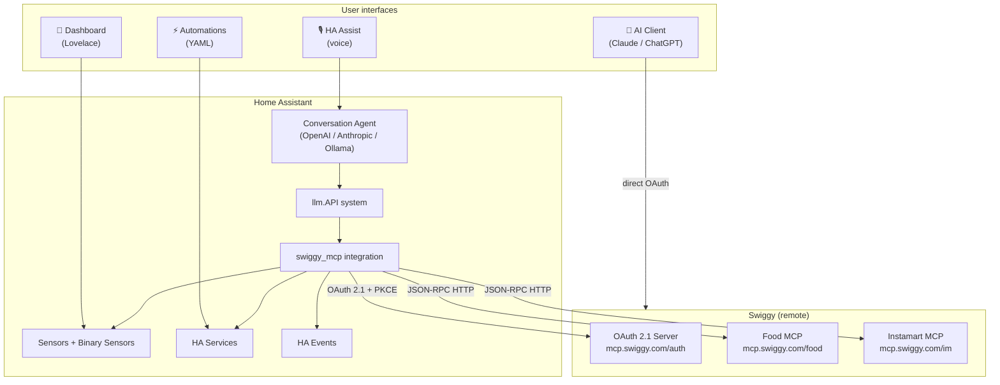
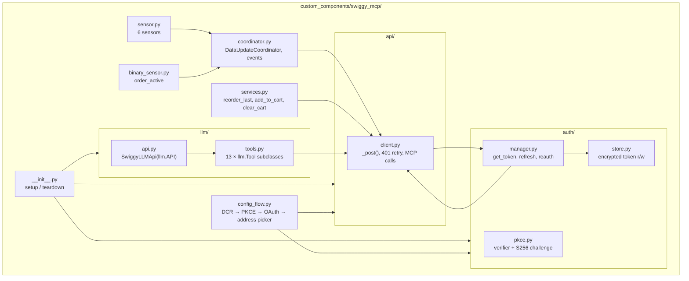
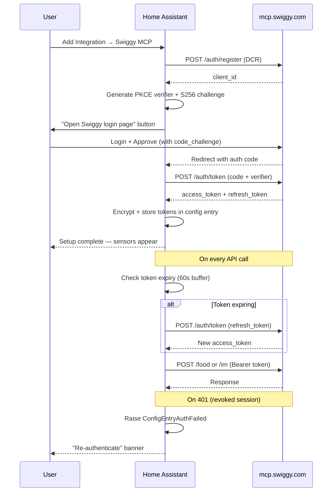
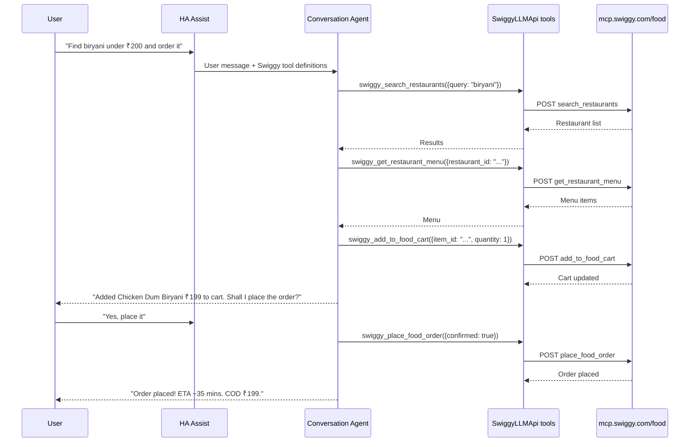

# Architecture — ha-swiggy-mcp

> Last updated: 2026-05-10

This document captures the key architectural decisions made during development of the **Swiggy MCP Home Assistant integration**, with diagrams for each major layer.

---

## Decision log

### 1 — HACS custom integration, not an add-on

**Decision:** Ship as a HACS custom integration (`custom_components/`), not a Home Assistant add-on.

**Rationale:**
- Swiggy MCP endpoints are plain HTTP POST (JSON-RPC 2.0) — no Docker proxy or sidecar needed
- Each user authenticates with their own Swiggy account — no shared credentials, no central relay
- Integrations get native HA entities, services, and events for free
- HACS install is one click vs. add-on repository + Docker pull

---

### 2 — OAuth 2.1 + PKCE, no bearer token input

**Decision:** Use Swiggy's OAuth 2.1 authorization code flow with PKCE (S256). No manual token entry.

**Rationale:**
- Swiggy's `.well-known/oauth-authorization-server` confirmed `authorization_code` + `refresh_token` grants and `S256` PKCE support
- Bearer tokens expire and require users to repeat a manual copy-paste step
- PKCE public client flow works without a client secret — safe for per-user installation
- Dynamic Client Registration (DCR) at `/auth/register` lets each HA instance self-register

**Auth endpoints (from `.well-known`):**
```
Authorization: https://mcp.swiggy.com/auth/authorize
Token:         https://mcp.swiggy.com/auth/token
Registration:  https://mcp.swiggy.com/auth/register
Scopes:        mcp:tools mcp:resources mcp:prompts
PKCE:          S256
```

---

### 3 — Isolated auth, api, llm layers

**Decision:** Auth, HTTP transport, and LLM tools are fully isolated modules. Entities and services never touch tokens.

**Rationale:**
- Tokens rotating silently should not require changes to sensors or services
- 401 retry logic lives in one place (`api/client.py`) — not spread across callers
- LLM tools call `client._post()` — they have no auth knowledge

---

### 4 — LLM Tool Layer inside the integration (no add-on)

**Decision:** Register a custom `llm.API` directly in the integration using HA's `homeassistant.helpers.llm` system.

**Rationale:**
- HA's `llm.Tool` + `llm.API` is a first-class extensibility point since HA 2024.x
- Any conversation agent the user has configured (Claude, OpenAI, Gemini, Ollama) automatically picks up registered APIs — zero extra user config
- Tools run inside HA's async event loop and share the `SwiggyApiClient` from the coordinator — no extra process, no IPC

---

### 5 — place_food_order confirmation gate

**Decision:** The `swiggy_place_food_order` LLM tool requires `confirmed: true` from the LLM before calling Swiggy's order endpoint.

**Rationale:**
- Swiggy food orders are **COD and cannot be cancelled**
- The gate forces the LLM to show the cart and ask the user before passing `confirmed=true`
- This is enforced at the tool level, not by prompt alone — the tool returns an error if `confirmed != true`

---

## High-level architecture



---

## Integration layer diagram



---

## OAuth 2.1 + PKCE flow



---

## LLM conversational ordering flow



---

## File structure

```
ha-swiggy-mcp/
├── custom_components/
│   └── swiggy_mcp/
│       ├── __init__.py            Integration setup/teardown, LLM API registration
│       ├── manifest.json          HACS + hassfest metadata
│       ├── const.py               All constants: endpoints, keys, defaults
│       ├── config_flow.py         DCR → PKCE → OAuth 2.1 → address picker → reauth
│       ├── coordinator.py         DataUpdateCoordinator — polls Swiggy, fires events
│       ├── sensor.py              6 sensors: status, eta, restaurant, amount, items, id
│       ├── binary_sensor.py       binary_sensor.swiggy_order_active
│       ├── services.py            reorder_last, add_to_cart, clear_cart
│       ├── services.yaml          Service UI definitions
│       ├── DOCS.md                User-facing documentation (shown in HACS)
│       ├── brand/
│       │   ├── icon.png           HACS brand icon (256×256)
│       │   └── logo.png           HACS brand logo
│       ├── translations/
│       │   └── en.json            UI strings for config flow
│       ├── auth/
│       │   ├── __init__.py
│       │   ├── pkce.py            generate_code_verifier, generate_code_challenge (S256)
│       │   ├── store.py           TokenStore — reads/writes config entry data
│       │   └── manager.py         SwiggyAuthManager — get token, refresh, reauth
│       ├── api/
│       │   ├── __init__.py
│       │   └── client.py          SwiggyApiClient — all MCP HTTP, 401 retry middleware
│       └── llm/
│           ├── __init__.py
│           ├── api.py             SwiggyLLMApi(llm.API) — system prompt + tool list
│           └── tools.py           13 × llm.Tool: Food (10) + Instamart (3)
├── .github/
│   └── workflows/
│       ├── validate.yml           HACS + hassfest on every push/PR
│       └── release.yml            Tag v*.*.* → version bump + GitHub Release
├── hacs.json                      HACS repo manifest
├── logo.png                       README branding
├── NOTES.md                       Developer reference (endpoints, constraints, phases)
├── ARCHITECTURE.md                This file
├── CONTRIBUTING.md                Contribution guide
└── README.md                      GitHub README
```

---

## Key constraints

| Constraint | Source | Enforcement |
|---|---|---|
| COD only, orders irreversible | Swiggy API | `place_food_order` tool gate (`confirmed: true` required) |
| Close Swiggy app during MCP | Swiggy session model | Documented; cannot enforce programmatically |
| Dineout free bookings only | Swiggy API | Documented |
| Auth token never in entities | Design decision | Entities read `coordinator.data` only |
| PKCE S256 mandatory | OAuth 2.1 best practice | Enforced in `auth/pkce.py` + `config_flow.py` |
| hassfest key sort order | HA validator | `manifest.json` keys: `domain`, `name`, then alphabetical |
| `http` in dependencies | hassfest rule | Required for OAuth external callback endpoint |
