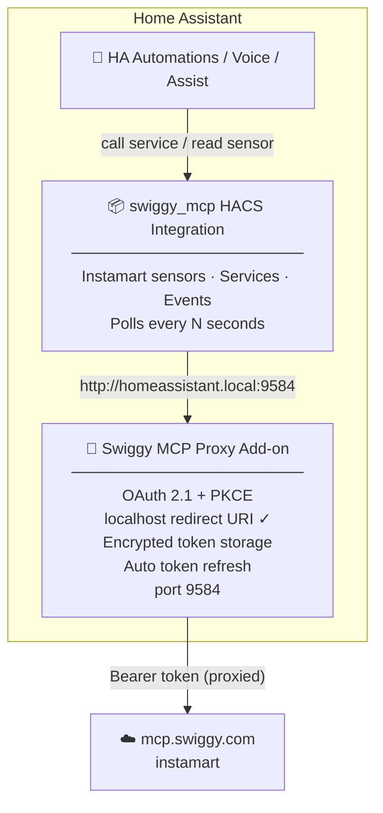
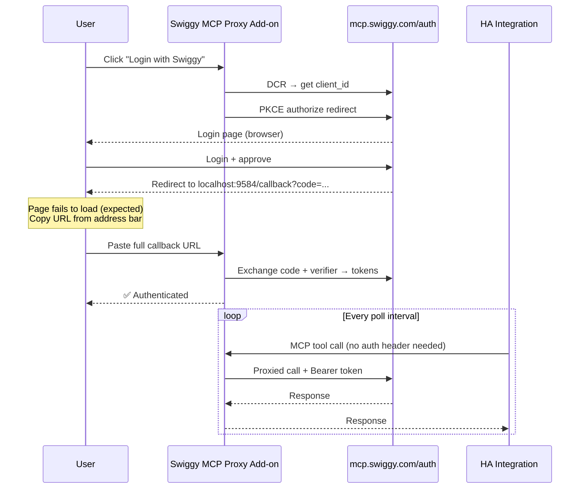
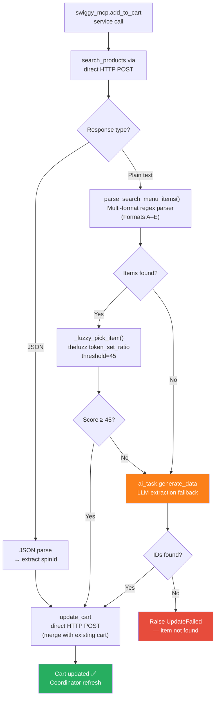

# Architecture — Swiggy MCP Home Assistant Integration

## System Overview

The integration is made up of two independently deployable parts:



**Why the add-on?** Swiggy's OAuth server only whitelists specific redirect URIs. `http://localhost` is on that list — HA's external callback URL is not. The add-on performs OAuth using a `localhost` redirect URI (valid per [RFC 8252](https://www.rfc-editor.org/rfc/rfc8252)), stores the tokens, and proxies every MCP call with them. The HACS integration just talks to the add-on — no auth complexity.

---

## Integration File Structure

### Add-on (`ha-swiggy-mcp-addon/`)
```
ha-swiggy-mcp-addon/
├── config.yaml        HA add-on manifest (port 9584, multi-arch, ingress)
├── build.yaml         Multi-arch base images (amd64 / aarch64 / armv7)
├── Dockerfile         Python 3.12 Alpine, installs requirements
├── requirements.txt   aiohttp, cryptography
└── src/
    ├── server.py      aiohttp web server — OAuth UI + proxy routes
    ├── oauth.py       DCR + PKCE + code-paste URL extraction
    ├── proxy.py       Forwards MCP calls with stored Bearer token
    └── storage.py     Read/write /data/tokens.json (persistent volume)
```

### HACS Integration (`custom_components/swiggy_mcp/`)
```
custom_components/swiggy_mcp/
├── auth/
│   ├── pkce.py        PKCE S256 verifier + challenge (direct mode)
│   ├── store.py       Encrypted token storage in HA config entry
│   └── manager.py     Auto-refresh, ConfigEntryAuthFailed on rejection
├── api/
│   └── client.py      MCP HTTP calls — add-on or direct endpoint
├── llm/
│   ├── api.py         SwiggyLLMApi — registers intent with HA Assist
│   └── tools.py       LLM tool definitions (Instamart MCP tools)
├── __init__.py        Entry setup + platform/service wiring
├── config_flow.py     Mode selection → add-on URL or OAuth 2.1 flow
├── coordinator.py     Polls every N seconds, fires HA events
├── sensor.py          Instamart order + cart sensors
├── binary_sensor.py   Instamart order active binary sensor
├── button.py          Instamart Clear Cart button
├── select.py          Delivery Address dropdown
├── services.py        add_to_cart, clear_cart
├── const.py           All constants
└── DOCS.md            User-facing integration docs
```

---

## Auth Flow (Add-on mode)



---

## Data Flow — add_to_cart Service

The `add_to_cart` service uses a multi-tier approach to handle Swiggy's inconsistent `search_products` response formats:



### Tier details

| Tier | Method | When used |
|---|---|---|
| 1 | JSON parse → direct field extraction | `search_products` returns structured JSON |
| 2a | `_parse_search_menu_items()` regex (Formats A–E) | Response is plain text with recognisable structure |
| 2b | `_fuzzy_pick_item()` via `thefuzz.token_set_ratio` | Multiple items parsed — pick best match for user's query |
| 3 | `ai_task.generate_data` LLM | Text parser found zero items (novel format) |

---

## Cart Total Resolution

Swiggy's cart API uses inconsistent field names and value types across versions. The `_find_total()` function in `client.py` uses a multi-step scan:

```
1. Direct top-level keys (numeric or currency-string):
   totalToPay, grandTotal, total, billTotal, totalAmount,
   itemTotal, cartTotal, orderTotal, cartTotalAmount

2. Nested {value: "₹195"} shape on known keys:
   toPay.value, totalToPay.value, grandTotal.value

3. Sub-object scan (billBreakdown, billBreakup, charges, bill, pricing):
   → same key scan within each sub-object
   → toPay.value / total.value within sub-objects
   → lineItems[] scan for "To Pay" / "Grand Total" labels

4. Multi-store shape:
   stores[i].billBreakdown / stores[i].billBreakup

5. Last resort:
   Any top-level key containing "total", "topay", "to_pay" with a parseable value
```

Currency strings are normalised by `_strip_currency()`:
- `"₹195"` → `195.0`
- `"Rs. 1,200.50"` → `1200.5`
- `195` → `195.0`

---

## Branch Strategy

| Branch | Focus | Status |
|---|---|---|
| `main` | Swiggy Instamart (groceries) | Stable, active development |
| `food` | Swiggy Food ordering | Work in progress — not yet stable |

The add-on (`ha-swiggy-mcp-addon/`) is shared and unchanged across branches.

---

## Mode Comparison

| Feature | Add-on mode | Direct mode |
|---|---|---|
| Works without Swiggy whitelist approval | ✅ | ❌ |
| OAuth via simple code-paste flow | ✅ | — |
| Full OAuth 2.1 + PKCE browser flow | — | ✅ |
| All sensors & binary sensors | ✅ | ✅ |
| All HA services | ✅ | ✅ |
| Voice / Assist integration | ✅ | ✅ |
| Auto token refresh | ✅ | ✅ |
