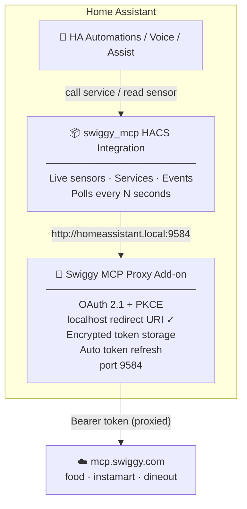

<div align="center">
  

  <h1>Swiggy MCP — Home Assistant Integration</h1>

  <p><strong>Order food, restock groceries & automate deliveries — right from your smart home.</strong><br/>
  A HACS custom integration + local add-on powered by the official <a href="https://mcp.swiggy.com">Swiggy MCP servers</a>.</p>

  <a href="https://github.com/pranjal-joshi/ha-swiggy-mcp/releases"></a>
  <a href="https://github.com/pranjal-joshi/ha-swiggy-mcp/stargazers"></a>
  <a href="https://github.com/pranjal-joshi/ha-swiggy-mcp/issues"></a>
  <a href="./LICENSE"></a>
  <a href="https://hacs.xyz"></a>
  <a href="https://github.com/pranjal-joshi/ha-swiggy-mcp/actions/workflows/validate.yml"></a>

  <br/><br/>

  > ⚠️ **Early Development / POC** — Not yet in the HACS default store. Add via custom repository URL below.

</div>

---

## 🍕 What is this?

**ha-swiggy-mcp** brings Swiggy into Home Assistant as a first-class citizen. It is made up of two parts that work together:

| Component | What it does |
|---|---|
| **Swiggy MCP Proxy Add-on** | Runs on your HA host. Handles OAuth via a simple code-paste flow, stores tokens securely, and proxies all MCP calls to Swiggy. |
| **swiggy_mcp HACS Integration** | Exposes live sensors, HA services, and events. Talks to the local add-on — no tokens, no OAuth complexity. |



**Why the add-on?** Swiggy's OAuth server only whitelists specific redirect URIs. `http://localhost` is on that list — HA's external callback URL is not. The add-on performs OAuth using a `localhost` redirect URI (valid per [RFC 8252](https://www.rfc-editor.org/rfc/rfc8252)), stores the tokens, and proxies every MCP call with them. The HACS integration just talks to the add-on — no auth complexity.

> **Direct mode** is also available as a fallback (integration connects directly to `mcp.swiggy.com` via OAuth), but requires Swiggy whitelist approval for your client. Add-on mode works out of the box.

---

## ✨ What you get

### 📊 Sensors

| Entity | Example state |
|---|---|
| `sensor.swiggy_order_status` | `Out for Delivery` |
| `sensor.swiggy_eta` | `12` (min) |
| `sensor.swiggy_restaurant` | `Behrouz Biryani` |
| `sensor.swiggy_billed_amount` | `349` (₹) |
| `sensor.swiggy_last_order_items` | `Chicken Dum Biryani, Raita` |
| `sensor.swiggy_order_id` | `ORD123456` |
| `binary_sensor.swiggy_order_active` | `on` / `off` |

### ⚡ Services

| Service | What it does |
|---|---|
| `swiggy_mcp.reorder_last` | Re-places your exact last order (COD) |
| `swiggy_mcp.add_to_cart` | Adds an item to Food or Instamart cart |
| `swiggy_mcp.clear_cart` | Clears your Food or Instamart cart |

### 🔔 Events

| Event | Fires when |
|---|---|
| `swiggy_mcp_out_for_delivery` | Order is picked up by delivery partner |
| `swiggy_mcp_order_delivered` | Order is delivered |

### 🆚 Mode comparison

| Feature | Add-on mode | Direct mode |
|---|---|---|
| Works without Swiggy whitelist approval | ✅ | ❌ |
| OAuth via simple code-paste flow | ✅ | — |
| Full OAuth 2.1 + PKCE browser flow | — | ✅ |
| All sensors & binary sensors | ✅ | ✅ |
| All HA services | ✅ | ✅ |
| Voice / Assist integration | ✅ | ✅ |
| Auto token refresh | ✅ | ✅ |

---

## 📦 Installation

### Step 1 — Add the repository as an HA Add-on source

1. **Settings → Add-ons → Add-on Store → ⋮ → Repositories**
2. Add: `https://github.com/pranjal-joshi/ha-swiggy-mcp`
3. Find **Swiggy MCP Proxy** and install it
4. Start the add-on and click **Open Web UI**

### Step 2 — Log in with Swiggy (code-paste flow)

1. In the add-on UI click **Login with Swiggy**
2. A Swiggy OAuth page opens in your browser — log in and approve
3. Your browser will try to redirect to `http://localhost:9584/callback?code=…` — **this page won't load, that's expected**
4. **Copy the full URL** from your browser's address bar (it contains `?code=...`)
5. Paste it into the add-on UI and click **Submit**
6. The UI shows ✅ Authenticated

### Step 3 — Install the HACS integration

[](https://my.home-assistant.io/redirect/hacs_repository/?owner=pranjal-joshi&repository=ha-swiggy-mcp&category=integration)

Or manually:
1. HACS → Integrations → ⋮ → **Custom repositories**
2. URL: `https://github.com/pranjal-joshi/ha-swiggy-mcp` · Category: **Integration**
3. Download and restart Home Assistant

### Step 4 — Add the integration

1. **Settings → Devices & Services → + Add Integration**
2. Search **Swiggy MCP** and click it
3. Select **Use Swiggy MCP Proxy add-on (recommended)**
4. Enter the add-on URL (default: `http://homeassistant.local:9584`)
5. Done — sensors appear immediately

> **No tokens to copy in HA.** The add-on owns all auth. The integration just reads data from the add-on endpoint.

---

## 🎙️ Voice Commands (HA Assist)

Add this to your `configuration.yaml`:

```yaml
intent_script:
  ReorderSwiggy:
    speech:
      text: "Reordering your last Swiggy order!"
    action:
      service: swiggy_mcp.reorder_last

  SwiggyOrderStatus:
    speech:
      text: >
        
          Your order from {{ states('sensor.swiggy_restaurant') }} is
          {{ states('sensor.swiggy_order_status') }},
          arriving in {{ states('sensor.swiggy_eta') }} minutes.
        
          No active Swiggy order right now.
        
```

Then say:
- *"Hey Home Assistant, reorder my last Swiggy order"*
- *"Hey Home Assistant, where's my Swiggy order?"*
- *"How long until my food arrives?"*

> **Note:** Complex ordering like "find me biryani under ₹200" requires an LLM (Claude, ChatGPT) connected directly to Swiggy's MCP tools. HA Assist handles fixed commands; conversational discovery needs an AI client.

---

## 🤖 Automation Examples

**Turn on the porch light when your delivery is near:**
```yaml
alias: Porch light when Swiggy is out for delivery
trigger:
  - platform: state
    entity_id: sensor.swiggy_order_status
    to: "Out for Delivery"
action:
  - service: light.turn_on
    target:
      entity_id: light.porch
mode: single
```

**TTS announcement when food arrives:**
```yaml
alias: Announce Swiggy delivery
trigger:
  - platform: event
    event_type: swiggy_mcp_order_delivered
action:
  - service: tts.speak
    data:
      message: "Your Swiggy order has been delivered. Enjoy your meal!"
      media_player_entity_id: media_player.living_room_speaker
mode: single
```

**Smart pantry restocking with a weight sensor:**
```yaml
alias: Auto-reorder rice when running low
description: >-
  Triggers when the weight sensor under the rice container drops below 1 kg.
  Adds rice to the Instamart cart for quick checkout.
trigger:
  - platform: numeric_state
    entity_id: sensor.rice_container_weight
    below: 1
    for:
      minutes: 5
condition:
  - condition: state
    entity_id: input_boolean.swiggy_auto_restock
    state: "on"
action:
  - service: swiggy_mcp.add_to_cart
    data:
      service: instamart
      query: "India Gate Basmati Rice 5kg"
      quantity: 1
  - service: notify.mobile_app
    data:
      title: "🛒 Rice running low!"
      message: "Added to your Instamart cart. Review and checkout in Swiggy."
mode: single
```

**Weekly grocery restock:**
```yaml
alias: Sunday grocery restock
trigger:
  - platform: time
    at: "10:00:00"
condition:
  - condition: time
    weekday: [sun]
action:
  - service: swiggy_mcp.reorder_last
mode: single
```

---

## 🏗️ Architecture

### Add-on (`ha-swiggy-mcp-addon/`)
```
ha-swiggy-mcp-addon/
├── config.yaml        HA add-on manifest (port 9584, multi-arch, ingress)
├── build.yaml         Multi-arch base images (amd64 / aarch64 / armv7)
├── Dockerfile         Python 3.12 Alpine, installs requirements
├── requirements.txt   aiohttp, cryptography
└── src/
    ├── server.py      aiohttp web server — OAuth UI + proxy routes
    ├── oauth.py       DCR + PKCE + code-paste URL extraction
    ├── proxy.py       Forwards MCP calls with stored Bearer token
    └── storage.py     Read/write /data/tokens.json (persistent volume)
```

### HACS Integration (`custom_components/swiggy_mcp/`)
```
custom_components/swiggy_mcp/
├── auth/
│   ├── pkce.py        PKCE S256 verifier + challenge (direct mode)
│   ├── store.py       Encrypted token storage in HA config entry
│   └── manager.py     Auto-refresh, ConfigEntryAuthFailed on rejection
├── api/
│   └── client.py      MCP HTTP calls — add-on or direct endpoint
├── config_flow.py     Mode selection → add-on URL or OAuth 2.1 flow
├── coordinator.py     Polls every N seconds, fires HA events
├── sensor.py          Live order sensors
├── binary_sensor.py   Order active binary sensor
└── services.py        reorder_last, add_to_cart, clear_cart
```

### Auth flow (add-on mode)
1. **DCR** — Add-on registers itself with Swiggy once, gets a `client_id` stored in `/data/`
2. **PKCE** — Code verifier + S256 challenge generated per login session
3. **Code-paste** — User copies `?code=...` URL from browser after Swiggy redirects to `localhost`
4. **Token exchange** — Add-on exchanges code + verifier for access + refresh tokens, stored in `/data/`
5. **Auto-refresh** — Proxy refreshes token 5 minutes before expiry, transparent to the integration
6. **Revocation** — Clear tokens via add-on UI; re-authenticate with one click

---

## ⚠️ Important Limitations

- **COD only** — orders placed via HA services are Cash on Delivery and **cannot be cancelled**. Always review your cart in the Swiggy app before any checkout action.
- **Close the Swiggy app** while the integration is active — running both simultaneously causes session conflicts on Swiggy's side.
- **Dineout** — free table bookings only (Swiggy limitation).
- **Conversational ordering** — searching menus, comparing restaurants, and full end-to-end multi-step ordering requires an LLM (Claude / ChatGPT) connected directly to `mcp.swiggy.com`. HA handles status and fixed-action services only.

---

## 🗺️ Roadmap

- [x] Project planning & architecture
- [x] Logo & branding
- [x] HACS custom integration scaffold
- [x] OAuth 2.1 + PKCE config flow (Dynamic Client Registration, direct mode)
- [x] Encrypted token storage + auto-refresh (direct mode)
- [x] DataUpdateCoordinator — live order polling
- [x] Sensors + binary sensors
- [x] Services — reorder_last, add_to_cart, clear_cart
- [x] HA events — out_for_delivery, order_delivered
- [x] GitHub Actions CI/CD (HACS + hassfest validation, release)
- [x] **Swiggy MCP Proxy Add-on** — local OAuth proxy with code-paste flow
- [x] **Add-on mode** in HACS integration (no OAuth needed in HA)
- [x] Multi-arch Docker build (amd64 / aarch64 / armv7)
- [ ] Dashboard card (Lovelace custom card)
- [ ] Instamart past orders sensor
- [ ] HACS default store submission
- [ ] Swiggy Builders Club production access

---

## 📈 Star History

<a href="https://star-history.com/#pranjal-joshi/ha-swiggy-mcp&Date">
  <picture>
    <source media="(prefers-color-scheme: dark)" srcset="https://api.star-history.com/svg?repos=pranjal-joshi/ha-swiggy-mcp&type=Date&theme=dark" />
    <source media="(prefers-color-scheme: light)" srcset="https://api.star-history.com/svg?repos=pranjal-joshi/ha-swiggy-mcp&type=Date" />
    
  </picture>
</a>

---

## 🤝 Contributing

PRs and issues welcome! Please read [CONTRIBUTING.md](./CONTRIBUTING.md) before starting a large change.

See [ARCHITECTURE.md](./ARCHITECTURE.md) for full design decisions and diagrams.

---

## 📄 License

[MIT](./LICENSE) — © [pranjal-joshi](https://github.com/pranjal-joshi)

---

<div align="center">
  <sub>Built with ❤️ by <a href="https://github.com/pranjal-joshi">pranjal-joshi</a> · Powered by <a href="https://mcp.swiggy.com">Swiggy MCP</a></sub>
</div>
